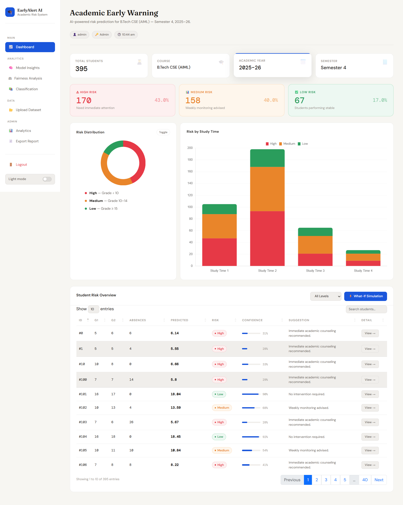
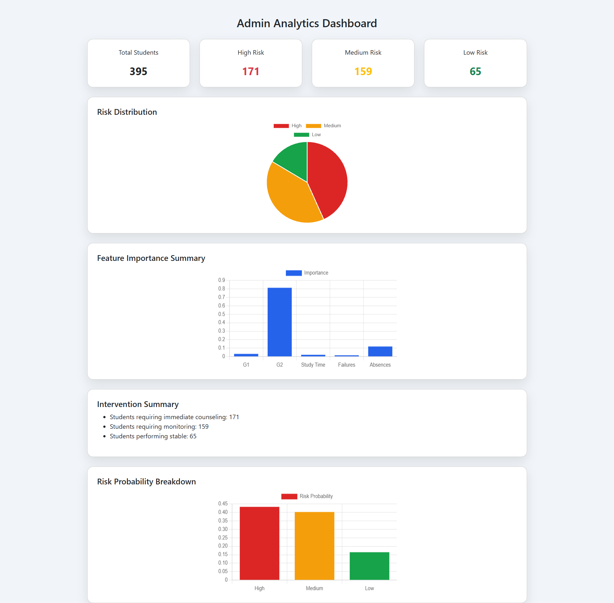
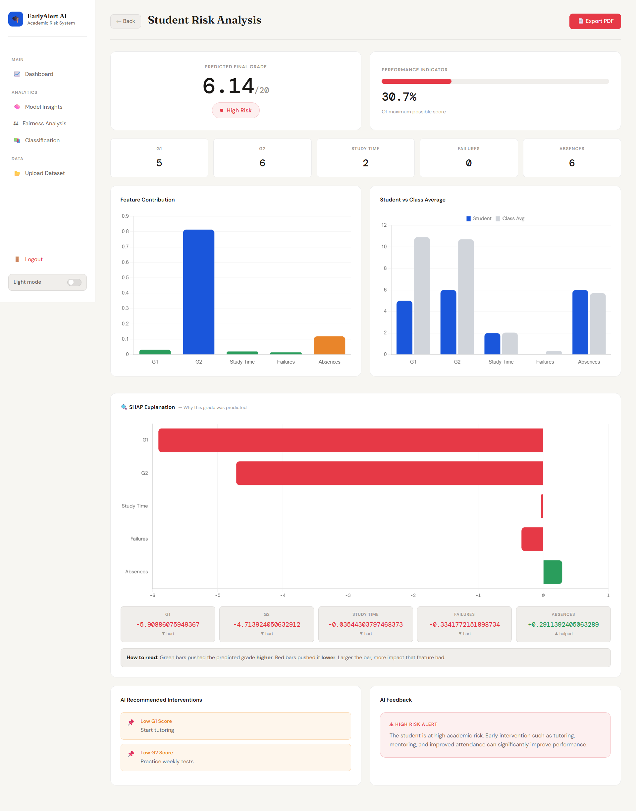

# 🎓 AI-Based Student Performance Prediction & Early Academic Intervention System

---

## 🚀 Overview

An end-to-end **AI-powered academic analytics platform** designed to **predict student performance early** and proactively identify at-risk students before academic failure occurs.

This system transforms traditional reactive monitoring into a **predictive, explainable, and decision-support framework** for educators.

---

## 🖥️ Application Preview

### 📊 Main Dashboard


### 📈 Admin Analytics Dashboard



### 🔍 Student Risk Analysis (SHAP + Interventions)



## 🎯 Problem Statement

Traditional academic systems detect struggling students **too late**.

This project introduces:

* Early performance prediction
* Automated risk classification
* Explainable AI insights
* Data-driven intervention recommendations

---

## 🧠 Machine Learning Pipeline

### 🔹 Models Used

* **Random Forest Regressor** → Predict final grade
* **Random Forest Classifier** → Predict risk category

### 🔹 Input Features

* G1 (First Internal Grade)
* G2 (Second Internal Grade)
* Study Time
* Past Failures
* Absences

### 🔹 Target

* G3 (Final Grade)

---

## 📊 Risk Classification

| Category       | Condition  |
| -------------- | ---------- |
| 🔴 High Risk   | Grade < 10 |
| 🟡 Medium Risk | 10 – 14    |
| 🟢 Low Risk    | ≥ 15       |

---

## 📈 Model Performance

* **MSE:** ~1.06
* **R² Score:** ~0.94
* **Classification Accuracy:** ~96%

✔ Strong predictive performance
✔ Balanced classification results

---

## 💡 Key Features

### 🤖 AI & Explainability

* Grade Prediction (Regression)
* Risk Classification (Classification)
* SHAP-style Explainability (feature impact)
* Feature Importance Visualization
* AI-Based Intervention Suggestions

---

### 📊 Dashboard & Analytics

* Risk Distribution (Pie + Bar charts)
* Student vs Class Comparison
* Feature Contribution Graphs
* Interactive Data Tables
* Real-time KPI Cards

---

### ⚖️ Fairness Analysis

* Gender-based risk comparison
* Age-group bias detection
* Ethical AI evaluation

---

### 🔐 Authentication System

* Role-based login (Admin / Teacher / Student)
* Session tracking
* Restricted features (Admin-only export)

---

### 📄 Report Generation

* PDF export for student analysis
* AI-based recommendations included

---

## 🏗️ System Architecture

1. Data Input (CSV Dataset)
2. Feature Engineering
3. ML Model Prediction
4. Risk Classification
5. Explainability Layer
6. Flask Backend
7. Interactive Frontend

---

## 🛠️ Tech Stack

### Backend

* Python
* Flask
* Pandas
* Scikit-learn
* ReportLab (PDF export)
* Joblib

### Frontend

* HTML5
* CSS3
* Bootstrap 5
* Chart.js
* JavaScript

### Database
* SQLite (students.db)

### Others

* Git & GitHub
* ReportLab (PDF Generation)

---

## ▶️ How to Run Locally

```bash
git clone https://github.com/Nikki31Chaudhary/Prediciting-Student-Performance.git
cd Prediciting-Student-Performance
pip install -r requirements.txt
python app.py
```

Open:

```
http://127.0.0.1:5000
```

---

## 🔐 Demo Credentials

| Role    | Username | Password |
| ------- | -------- | -------- |
| Admin   | admin    | 123456   |
| Teacher | teacher  | 123456   |
| Student | student  | 123456   |

---

## 🌍 Deployment (Future Scope)

* Render / Railway / AWS
* Gunicorn for production
* Environment variable configuration

---

## 📈 Impact

* Early detection of at-risk students
* Improved academic outcomes
* Transparent AI-based decisions
* Data-driven educational insights

---

## 🔮 Future Enhancements

* Database-backed authentication
* Secure password hashing
* Real SHAP integration
* Real-time model retraining
* CI/CD deployment
* Advanced AI recommendations

---

## 👩‍💻 Authors

* **Shristi Upadhyay**
* **Nikki Chaudhary**

---

## 🎯 Academic Project Highlights

✔ Machine Learning Deployment
✔ Explainable AI (XAI)
✔ Full-Stack Development
✔ Data Visualization
✔ Role-Based System Design

---

⭐ If you found this project useful, consider giving it a star!
